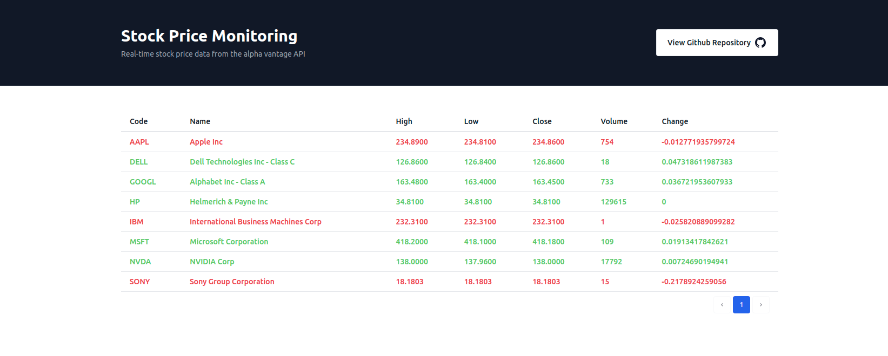

# Stock Price Monitoring




## Overview
This project is a Laravel application that runs within Docker containers. This README provides instructions on setting up the development environment, requirements, and steps to get started.

## Requirements

Before you begin, ensure you have the following installed on your machine in case of ignoring docker installation:

- PHP 8.3 or higher
- [Docker](https://www.docker.com/get-started) (latest version)
- [Docker Compose](https://docs.docker.com/compose/install/) (latest version)
- NPM package installer (for managing frontend dependencies)
- [Composer](https://getcomposer.org/download/) (latest version) (for managing PHP dependencies)


## Setup Process

1. **Clone the Repository**:  
   Clone the project repository to your local machine using the following command:
   ```bash
   git clone https://github.com/hamidgh83/real-time-stock-aggregator.git
   cd real-time-stock-aggregator
   ```
   
2. **Install the composer and npm packages**  
   Run composer and npm to install the required packages:

   ```bash
   composer install
   npm install
   ```

3. **Get the API Key**:
   To use the application, you need to obtain an API key from the [Alpha Vantage API](https://www.alphavantage.co/). Once you have the API key, update the `.env` file with the key.

4. **Configure Environment Variables**:
   Copy the .env.example file to .env and update the necessary environment variables.

   ```bash
   cp .env.example .env
   ```

5. **Build and Run the Docker Containers**:
   Run the following command to build and start the Docker containers:

   ```bash
   docker-compose up -d
   ```
   After the containers are up and running, you can access the application at http://localhost:8001.

   Please note that it might take a few minutes for the containers to be fully initialized and the application to be accessible.

After following these steps, you should have a working Laravel application running within Docker containers.

6. **Initialize the database**:
   Run seeder command to populate the database with initial data:

   ```bash
   php artisan db:seed --class=StockSymbolsSeeder
   ```
This command will populate the database with stock symbols.

